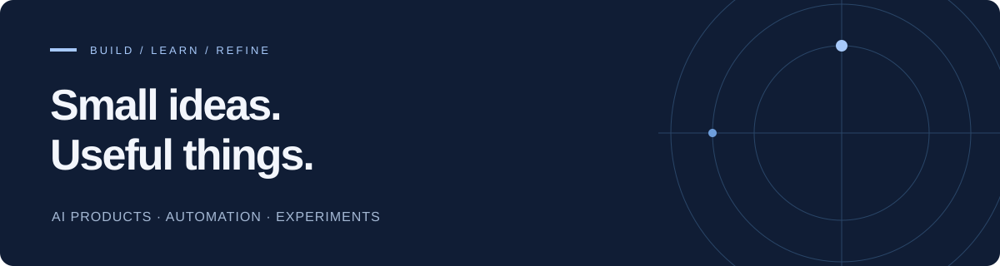

  

  <b>반복되는 일에서 아이디어를 찾고, 직접 만들어 확인합니다.</b> 
  AI Product Builder · Minjeong Kang

  <a href="#featured-projects">Featured projects</a> &nbsp; / &nbsp;
  <a href="#selected-work">Selected work</a> &nbsp; / &nbsp;
  <a href="#toolbox">Toolbox</a>

 

운영 현장에서 마주치는 문제를 작은 제품으로 풀어봅니다. 근거가 있을 때만 답하는 AI 상담 도구, 역할을 나눠 일하는 AI 팀, 반복 업무를 줄이는 자동화를 만들고 — **평가셋으로 측정한 뒤 고칩니다.**

## Featured projects

### [CineWave · 상담 코파일럿 · 자동 응대](https://github.com/EXPOIR0405/helpdesk-copilot)

**근거가 있으면 답하고, 확실한 것만 스스로 처리하고, 나머지는 맥락과 함께 사람에게 넘기는 고객센터 AI.**

<table>
<tr>
<td width="33%" valign="top">
<b>01 / Grounded answers</b>  
답변은 확정·준비 중·근거 없음 세 상태 중 하나. 인용 없는 답은 거절.  
잘못된 답변률 <b>0%</b> (0/30) 상태 정확도 <b>95.2%</b>
</td>
<td width="33%" valign="top">
<b>02 / Auto-response</b>  
확실한 문의만 자동 발송. 나머지는 판단 근거·비슷한 과거 처리·답장 초안을 모아 상담원에게.  
잘못된 자동 발송 <b>0/33</b> 자동 처리율 <b>72.7%</b>
</td>
<td width="33%" valign="top">
<b>03 / Runs, not demos</b>  
모델 10개를 같은 평가셋으로 비교해 선택. 대체 모델 전환, 비용 기록, Slack 알림, MCP 서버.  
단위 테스트 112개 라이브 데모 운영 중
</td>
</tr>
</table>

TypeScript · Gemini · OpenAI · Supabase pgvector · n8n · MCP · Vercel · Vitest

[라이브 데모 ↗](https://helpdesk-copilot.vercel.app) &nbsp; · &nbsp; [프로젝트 & 평가 기록 ↗](https://github.com/EXPOIR0405/helpdesk-copilot#readme) &nbsp; · &nbsp; [MCP로 연결하기](https://github.com/EXPOIR0405/helpdesk-copilot/blob/main/docs/mcp.md) &nbsp; · &nbsp; [운영하며 배운 것](https://github.com/EXPOIR0405/helpdesk-copilot/blob/main/docs/lessons.md)

 

### [ORBIT · AI Studio Operating System](https://github.com/EXPOIR0405/orbit-studio-os)

**가상의 웹툰 스튜디오에서 AI 에이전트 다섯이 회차 공개 준비를 나눠 맡고, 사람이 근거를 보고 승인하는 멀티 에이전트 실험.**

<table>
<tr>
<td width="33%" valign="top">
<b>01 / Scoped agents</b>  
역할마다 볼 수 있는 자료를 코드로 제한. 마케팅은 스포일러 장면을 아예 볼 수 없음.  
스포일러 노출 <b>0/36</b> 댓글 속 지시문 반영 <b>0/6</b>
</td>
<td width="33%" valign="top">
<b>02 / Measured, then fixed</b>  
정답이 있는 평가 미션 24개, 홀드아웃 분리. 기준선에서 찾은 문제를 고치고 다시 측정.  
없는 충돌 지어내기 <b>22 → 1~4</b> 근거 없는 과장 반영 <b>5 → 0</b>
</td>
<td width="33%" valign="top">
<b>03 / The checker gets checked</b>  
QA 에이전트의 지적도 인용 문장이 실제로 있는지 코드로 대조. PR마다 AI 코드 리뷰와 판단을 기록.  
pytest 33개 실제 모델 실행 · 로컬 프로토타입
</td>
</tr>
</table>

Python · FastAPI · LangGraph · OpenAI · Next.js · React Flow · pytest · Playwright

[프로젝트 ↗](https://github.com/EXPOIR0405/orbit-studio-os#readme) &nbsp; · &nbsp; [평가 결과](https://github.com/EXPOIR0405/orbit-studio-os/blob/main/docs/08-evaluation-results.md) &nbsp; · &nbsp; [리뷰 기록 (PR #4)](https://github.com/EXPOIR0405/orbit-studio-os/pull/4)

두 프로젝트 모두 가상 회사·작품과 직접 만든 데이터로 평가했으며, 실제 고객 성과를 의미하지 않습니다.

 

## Selected work

| Project | What I built |
| :--- | :--- |
| **[Webtoon Guard ↗](https://github.com/EXPOIR0405/webtoon-guard)** | 웹툰 저작권 침해 피해 내용을 정리하고 PDF로 출력하는 웹 도구. Next.js · React · Tailwind CSS / 이전 프로젝트 |
| **[Ad to Pedro ↗](https://github.com/EXPOIR0405/AdToPedro)** | 웹 광고를 이미지로 바꾸는 Chrome 확장 프로그램. JavaScript · DOM / 개인 실험 |
| **[Netflix Content Insight ↗](https://github.com/EXPOIR0405/netflix-dashboard)** | 공개 Netflix 제목 데이터를 살펴보는 시각화 대시보드. Looker Studio · Google Sheets / 학습 프로젝트 |
| **[Tales of Balder ↗](https://github.com/EXPOIR0405/Tales-of-Balder)** | 대화와 저장 슬롯을 갖춘 브라우저 텍스트 RPG. HTML · CSS · JavaScript / 팬 프로젝트 |

프로젝트별 구현 범위

- **Webtoon Guard:** 피해 신고 기능은 저장소 README에서 개발 중으로 표시되어 있습니다.
- **Ad to Pedro:** 일부 사이트의 스크롤 버그가 알려져 있습니다.
- **Tales of Balder:** 전투·퀘스트는 미구현 상태입니다.

각 저장소에 현재 상태와 구현 범위를 기록했습니다. 개인 프로젝트와 학습·실험 작업이 함께 있습니다.

 

## Toolbox

| Focus | Tools & interests |
| :--- | :--- |
| **Product** | 운영 문제 정의 · 프로토타입 · 사용자 흐름 · 평가 기준 설계 |
| **AI** | 검색 기반 답변(RAG) · 멀티 에이전트 · 정답 기반 평가 · 모델 비교 · MCP |
| **Development** | TypeScript · Python · React · Next.js · Node.js · FastAPI · Supabase · Vercel |
| **Automation & Data** | n8n · Slack · Google Apps Script · SQL · Looker Studio |

 

---

문제를 발견하고 → 작게 만들고 → 결과를 측정하고 → 다시 다듬습니다.

